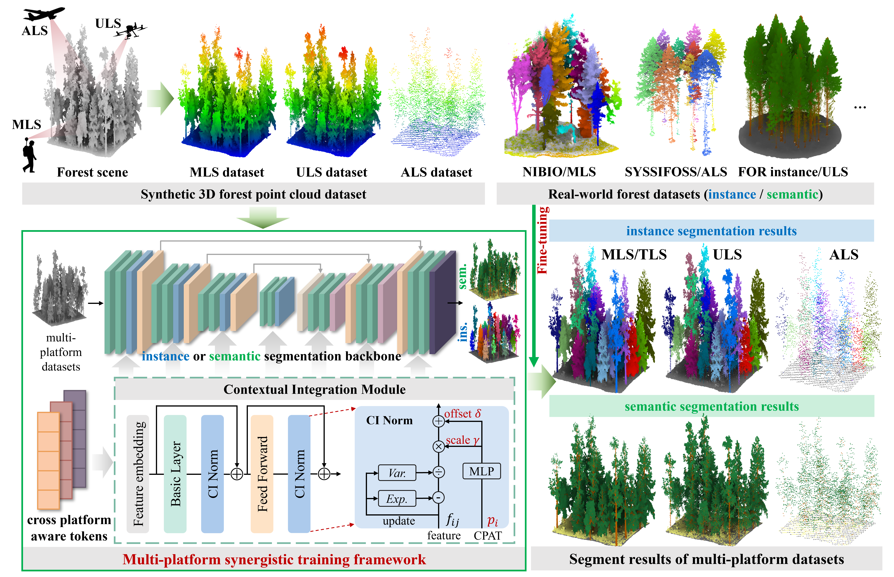

# :deciduous_tree:MST

#  Cross-Platform forest understanding: A multi-platform synergistic training framework for generalized forest point cloud segmentation

<div align="center">
Jundi Jiang</a><sup>1,3</sup>, Yueqian Shen</a><sup>1</sup>, Jinhu Wang</a><sup>2</sup>, W Daniel Kissling</a><sup>2</sup>, Markus Hollaus</a><sup>3</sup>, Hongjun Su</a><sup>4</sup>, Jinguo Wang</a><sup>1</sup>, Vagner Ferreira</a><sup>1</sup>  <div align="center">  
---------------------------------------------------------------------------------------------------------------------------------
</p">  


<div align="center">

</a><sup>1</sup>School of Earth Sciences and Engineering，Hohai University,  

</a><sup>2</sup>Institute for Biodiversity and Ecosystem Dynamics (IBED)， University of Amsterdam，  

</a><sup>3</sup>Department of Geodesy and Geoinformation, Vienna University of Technology, 

</a><sup>4</sup>College of Geography and Remote Sensing, Hohai University.



<div align="left">

# Notes 	
<div align="left">
  
We adapt the codebase of [Pointcept](https://github.com/Pointcept/Pointcept), which  is a powerful and flexible codebase for point cloud perception research. Please refer to [Pointcept](https://github.com/Pointcept/Pointcept) if you need more information.

## Installation
### Requirements
<div align="left">
Ubuntu: 22.04  

CUDA: 12.4  
PyTorch: 2.4.1  

We recommend using [anaconda](https://www.anaconda.com/) or [miniconda](https://docs.anaconda.com/miniconda/) to build your virtual environment.

Please follow the [Installation](https://github.com/Pointcept/Pointcept/tree/main#installation) to build your conda environment, or you can refer to [requirements](./requirements.txt).

## Usage
#### Step 1: activate your environment
```
conda activate your_env_name
```
#### Step2: get into your project root
```
cd your/project/path
```
#### Step 3: prepare your dataset  
We followed the format of the S3DIS dataset to prepare the dataset and the raw forest point cloud data should be in txt format.   

run the [preprocess_s3dis.py](pointcept/datasets/preprocessing/s3dis/preprocess_s3dis.py)
```
python pointcept/datasets/preprocessing/s3dis/preprocess_s3dis.py --dataset_root /your/original/dataset/path --output_root /your/output/path
```
Assign a condition (i.e., platform identity) to the processed file:
```
python tools/assign_platform_condition.py --data-root /path/to/ALS_dataset --condition ALS
python tools/assign_platform_condition.py --data-root /path/to/ULS_dataset --condition ULS
python tools/assign_platform_condition.py --data-root /path/to/MLS_dataset --condition MLS
```


#### Step 4: pretrain on virtual synthetic dataset  
for **semantic segmentation**, modify the config file in [semseg_ptv3_mst.py](configs/pre_train/semseg_ptv3_mst.py)  

then run the command line below:
```
python tools/train.py --config-file configs/pre_train/semseg_ptv3_mst.py --options save_path=exp/MST_sem
```
for **instance segmentation**, modify the config file in [insseg_ptv3_mst.py](configs/pre_train/insseg_pointgroup_mst.py)  

then run the command line below:
```
python tools/train.py --config-file configs/pre_train/insseg_pointgroup_mst.py --options save_path=exp/MST_ins 
```

#### Step 5: fine tuning on real-world dataset using the pre-trained best model
for **semantic segmentation**, modify the config file in [semseg_finetuning.py](configs/fine_tuning/semseg_finetuning.py)  

then run the command line below:
```
python tools/train.py --config-file configs/fine_tuning/semseg_finetuning.py --options save_path=exp/MST_sem_finetuning resume=False weight=exp/MST_sem/model/model_best.pth
```
for **instance segmentation**, modify the config file in [insseg_finetuning.py](configs/fine_tuning/insseg_finetuning.py)   

then run the command line below:
```
python tools/train.py --config-file configs/fine_tuning/insseg_finetuning.py --options save_path=exp/MST_ins_finetuning resume=False weight=exp/MST_ins/model/model_best.pth
```

### :warning: note
 :black_circle: When you perform the **semantic segmentation** task, uncomment the [prepare_test_data](https://github.com/jdjiang312/MST/blob/9ed867e6f0699d790bdf7eb384f5cb04e2c93f4d/pointcept/datasets/s3dis.py#L148-L195) function for **instance segmentation** in [s3dis.py](pointcept/datasets/s3dis.py)  

Similarly, uncomment the [GridSample](https://github.com/jdjiang312/MST/blob/9ed867e6f0699d790bdf7eb384f5cb04e2c93f4d/pointcept/datasets/transform.py#L915-L1042) function for **instance segmentation** in [transform.py](pointcept/datasets/transform.py)  

 :black_circle: If you need to perform the **instance segmentation** task, uncomment the [prepare_test_data](https://github.com/jdjiang312/MST/blob/9ed867e6f0699d790bdf7eb384f5cb04e2c93f4d/pointcept/datasets/s3dis.py#L110-L143) function for **semantic segmentation** in [s3dis.py](pointcept/datasets/s3dis.py)  

Similarly, uncomment the [GridSample](https://github.com/jdjiang312/MST/blob/9ed867e6f0699d790bdf7eb384f5cb04e2c93f4d/pointcept/datasets/transform.py#L771-L910) function for **semantic segmentation** in [transform.py](pointcept/datasets/transform.py)  

## Citation
